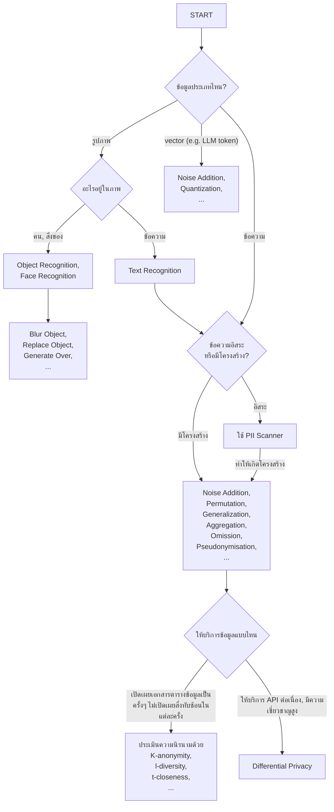

# Anonymize ยังไงดี?

```mermaid
graph TD
    START --> WHAT_TYPE{ข้อมูลประเภทไหน?}

    WHAT_TYPE -- รูปภาพ --> WHAT_IS_IN_IMAGE{อะไรอยู่ในภาพ}
    WHAT_IS_IN_IMAGE -- คน, สิ่งของ --> OBJECT_RECOGNITION["`
    Object Recognition,
    Face Recognition
    `"] --> BLUR["`
    Blur Object,
    Replace Object,
    Generate Over,
    ...
    `"]
    WHAT_IS_IN_IMAGE -- ข้อความ --> TEXT_RECOGNITION[Text Recognition]

    WHAT_TYPE -- vector (e.g. LLM token) --> VECTOR_PROCESSING["`
    Noise Addition,
    Quantization,
    ...
    `"]

    WHAT_TYPE -- ข้อความ --> IS_FREE_TEXT{"`
    ข้อความอิสระ
    หรือมีโครงสร้าง?
    `"}
    TEXT_RECOGNITION --> IS_FREE_TEXT
    IS_FREE_TEXT -- มีโครงสร้าง --> TRADITIONAL
    IS_FREE_TEXT -- อิสระ --> PII_SCANNER[ใช้ PII Scanner]
    PII_SCANNER -- ทำให้เกิดโครงสร้าง --> TRADITIONAL
    TRADITIONAL["`
    Noise Addition,
    Permutation,
    Generalization,
    Aggregation,
    Omission,
    Pseudonymisation,
    ...
    `"]
    TRADITIONAL --> HOW_OUTPUT{ให้บริการข้อมูลแบบไหน}
    HOW_OUTPUT -- เปิดเผยเอกสารตารางข้อมูลเป็นครั้งๆ ไม่เปิดเผยสิ่งทับซ้อนในแต่ละครั้ง --> K["`
    ประเมินความนิรนามด้วย
    K-anonymity,
    l-diversity,
    t-closeness,
    ...
    `"]
    HOW_OUTPUT -- ให้บริการ API ต่อเนื่อง, มีความเชี่ยวชาญสูง --> Diff[Differential Privacy]
```
